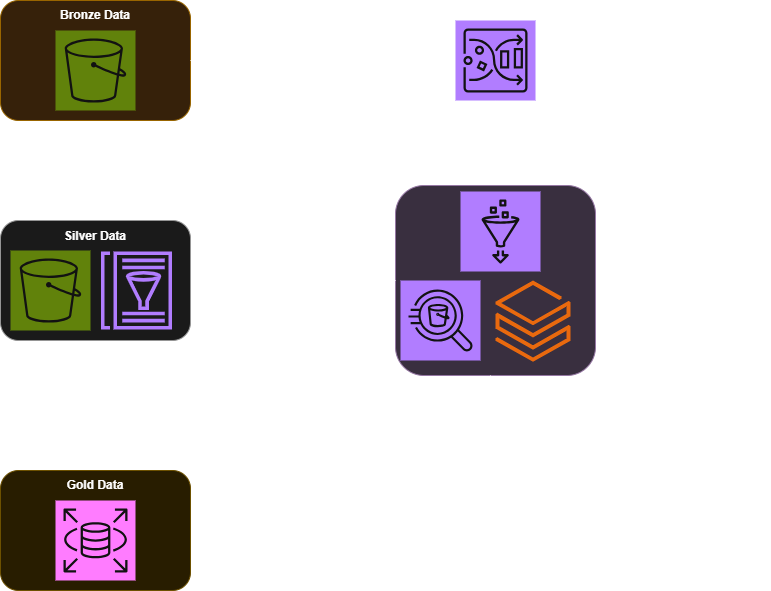

# Data Processing

This application is a toy example of Glue based data processing application, using StackOverflow developer survey as
exemplary data. The app contains set-up for transforming raw CSV with survey data for particular year into normalized
SQL database, hosted on Amazon RDS. All transformations are done in PySpark and can be run as Glue jobs.

### Components

1. AWS Glue Data Catalog - metadata store for the data, used to store table definitions for raw CSV data, structured
   data and normalized data. 
2. Glue ETL Ingest Workflow - PySpark script for transforming raw CSV data into structured schema and storing it in Glue Data Catalog.
3. Glue ETL Transform Workflow - PySpark script for transforming structured data into normalized schema and storing it on S3 as parquet files.
4. Amazon RDS - PostgreSQL database for storing normalized data, with table definitions and data insertion script.
5. Networking - VPC and security group set-up for RDS, allowing access from Glue jobs, uses IP whitelisting for security.
6. Workflow Jupyter Notebook - example workflow for running the application flow using Python.
7. Glue ETL Terraform Module - generic IaC set-up for Glue ETL jobs, used by all Glue jobs in the application.
8. SOPS - tool for managing secrets, used to store database credentials in encrypted format.



# Layout

* `infra`
  * `database.tf` - Amazon RDS set-up
  * `glue.tf` - AWS Glue Data Catalog and Glue Crawler set-up
  * `ingest.tf` - AWS Glue ETL job for transforming raw data into structured schema and storing it in Glue Data Catalog
  * `network.tf` - VPC and security group set-up for RDS
  * `transform.tf` - AWS Glue ETL job for transforming raw data into normalized schema
* `src`
  * `db` - PostgreSQL database client and SQL script with table definitions and local PySpark script for data insertion
  * `glue` - PySpark scripts source code
  * `workflow.ipynb` - Jupyter notebook with example workflow for running the app using python scripts

*Note*: Transforming such data in normalized schema is not usually done, this application is meant as example showcasing
AWS Glue, Athena and PySpark for educational purpose. In real-world case analytical schema would be probably better,
Stack Overflow data could be also easily analysed using just Glue Crawler + Athena setup. PySpark might also be overkill
for such small dataset.

# AWS Glue Data Catalog

AWS Glue is a ETL services, allowing to connect to various data sources and run ETL jobs in PySpark without managing
the underlying infrastructure [1]. Glue fundamentally consists of three concepts:
* Data Catalog - metadata store with table definitions and control information (no physical data is stored)
* Crawlers - programs for connecting to the data sources, they can infer schema and create table definitions in Data Catalog
* Jobs - ETL jobs, which are the actual workers, written in Spark, which is extended by AWS Glue with extra features

All those components are used in these applications, Data Catalog is used to store data definitions with different degree
of processing, firstly using Glue Crawler to infer schema from raw CSV files, then using Glue ETL job to transform the
data into structured parquet files, and finally using another Glue ETL job to transform the data into normalized schema.

### AWS Athena

AWS Athena is a serverless query engine [2], which allows to run SQL queries on data stored in S3. It uses Glue Data Catalog
as a metadata store, and can be used to query data stored in various formats, such as CSV, JSON, Parquet or ORC. Athena
is based on Presto, which is an open-source distributed SQL query engine. It is a serverless service, so there is no need
to manage the underlying infrastructure. Athena is charged based on the amount of data scanned.

In this applications Athena is used to query and look around the data on different levels of processing, apart from the
last step, where data is in PostgreSQL database.

# Glue ETL Jobs

There are two Glue ETL jobs in this application, one for transforming raw CSV data into structured schema and storing
it in Glue Data Catalog, and another for transforming structured data into normalized schema and storing it. Both are
implemented using PySpark, which is a Python API for Apache Spark, allowing to write distributed data processing.

Glue uses python library written on top of PySpark, which is extended with additional features. To load and write
data-frames from Glue Data Catalog, the `DynamicFrame` class is used, which can be thought of as a Spark DataFrame
with additional metadata, designed specifically for Glue.

### Glue Workers

AWS Glue is priced mostly based on DPU (data-processing-unit) runtime. DPUs are used for crawlers and ETL jobs, where
the size of the machine is counted as multiples of DPU. The options range from `G.025X` (1/4 DPU), to standard `G.1X`
and up to `G.8X` with 32 vCPUs and 128GB of memory [3].

AWS Glue ETL can be written is Python or Scala, where python scripts need to be based on PySpark. Binary supported
libraries, such as pandas or numpy are not supported.

# Amazon RDS

RDS (Relational Database Service) is a managed database service, which allows to run various database engines. In this
application PostgreSQL is used, but RDS supports also MySQL, MariaDB, Oracle and Microsoft SQL Server [4]. The schema of the
database is simple, defined in `db/sql/schema.sql` file. The RDS uses FreeTier template, which is a single instance
with 20GB of storage, which is enough for this application.

# Networking

In this application VPC is used to host the RDS database. The VPC is set up with public and private subnets, where the
`default` VPC for AWS Account is used. The RDS database is hosted in the private subnet and approach of IP whitelisting
is used to allow access to the database from the Glue jobs. The security group is set up to allow access from single IP
given as terraform variable.

*Note*: If using the copy of this infrastructure, set the IP to desired address, ideally under the University VPN, which
will prevent access from outside this network to the RDS. This is educational example, so strict security is not
required. In production use cases IP whitelisting is not advised as safety gold standard.

# Workflow Jupyter Notebook

This notebook, contains the flow of data processing application. The goal of the app is to use Glue ETL data Glue Data
Catalog to register data from Stack Overflow survey into PostgreSQL database. All required resources can be created
using the `infra` defined in this repository. There is no external orchestration of the flow, but this notebook can be
treated as guideline how to trigger required steps via AWS Console or Python.

# SOPS

SOPS (Secrets OPerationS) is a tool for managing secrets in a secure way [5]. It allows to encrypt and decrypt files
containing sensitive information, such as database credentials. In this application SOPS is used to store the database
credentials in encrypted format, which can be decrypted using the `sops` command.

The config (with secrets) is stored in `infra/config/secrets.yaml` file, which is encrypted using SOPS and only the 
encrypted version is committed to the repository. The secrets can be decrypted using the `sops` command, which requires
the AWS KMS key to decrypt. This key is added via `backend` application (in terraform), and its ARN is given in the
`infra/config/.sops.yaml` file.

To decrypt the secrets, use the following command:

```bash
sops -d infra/config/secrets.enc.yaml > infra/config/secrets.yaml
```

To encrypt run following command:

```bash
sops -e infra/config/secrets.yaml > infra/config/secrets.enc.yaml
```

## References

<a id="1">[1]</a>
AWS Glue
*What is AWS Glue?*
https://docs.aws.amazon.com/glue/latest/dg/what-is-glue.html

<a id="2">[2]</a>
AWS Athena
*What is Amazon Athena?*
https://docs.aws.amazon.com/athena/latest/ug/what-is.html

<a id="3">[3]</a>
AWS Glue
*Jobs*
https://docs.aws.amazon.com/glue/latest/dg/aws-glue-api-jobs-job.html

<a id="4">[4]</a>
Amazon RDS
*What is Amazon RDS?*
https://docs.aws.amazon.com/AmazonRDS/latest/UserGuide/CHAP_Overview.html

<a id="5">[5]</a> 
GitHub 
*SOPS*
https://github.com/getsops/sops
