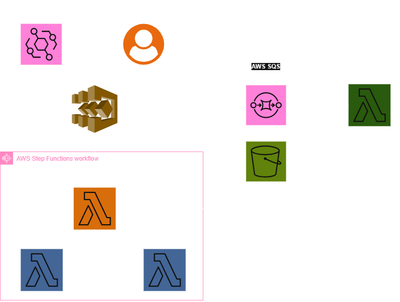

# Serverless

This application is example IoT processing application using AWS Lambda, DynamoDB and Step-Functions. The application
has number of features and is deployed using terragrunt with parameterized configuration.

### Components

1. Sensor Lambda - function is an example of IoT ingest from remote sensor, doing simple calculation
2. DynamoDB - storage for broken sensors, used by sensor lambda
3. SQS - communication layer between sensor and analytics module
4. Analytics - step-function processing inputs from SQS and computing moving-averages in time, uses 2 Lambda functions
5. Trigger Sensor Script - script simulating real-world data generating process, by sending requests with random inputs with random intervals
6. Terraform Lambda Module - generic IaC set-up for Lambda functions, used by all Lambda functions in the application
7. Terragrunt - IaC orchestrator for terraform using configuration parameterized by YAML files to deploy `dev` and `prod` environments

# Sensor Lambda

Sensor Lambda is an example function, which simulates endpoint for receiving measurements from IoT sensor network. Each
measurement is simulating the resistance on termo-resistor, allowing to compute the temperature for known coefficients 
following the Steinhart–Hart equation [1].

### Flow

The flow of function is the following:
1. Load input JSON.
2. Check `sensor_id` in DynamoDB with registry of broken sensors, add `sensor_id` to registry, if it is seen first time.
3. Check, if given input is in acceptable range and mark sensor as broken, when it is not.
4. Compute the Temperature using the simulation (equation below).
5. Write message to SQS.
6. Notify user by SNS, when unexpected status is encountered.
7. Return event with the status.

**Note**: Details on the values of temperature to meet given status are irrelevant, they should serve as an example.
Details values can be found directly in the code and changed, if needed.

### Equation

$$
\frac{1}{T} = a + bln(R)+c(lnR)^3
$$

$a$, $b$ and $c$ are constants specific for given material. Values assumed for the simulation are: $a = 1.40 \cdot 10^{-3}$,
$b=2.37 \cdot 10^{-4}$ and $9.90 \cdot 10^{-8}$.

# DynamoDB

DynamoDB is used as storage for broken sensors to prevent race conditions. Schema of DynamoDB is very simple, it
contains only the `primary_key` as `sensor_id` and keep register of all sensors with boolean `broken` column. The sensor
registry is meant to be read at row level only, each lambda accessing single record at a time.

DynamoDB with its fast read and write capacity should handle the cases, when 2 lambda executions get the measurement
from the same sensor at similar time. In case a sensor is marked as broken, there is no way of changing it back to
working. 

### Idempotency Layer

The sensor Lambda is used in simulated IoT network, so additional idempotency layer is used to prevent double executions
on the same input, as could happen in real case of IoT. The property of idempotency means that an operation does not
cause additional side effects if it is called more than once with the same input parameters. This is done using AWS
Lambda Powertools library [2], the implementation details can be found in the documentation of the library.

# SQS

The goal of SQS is to decouple the sensor Lambda from the analytics module. The sensor Lambda writes messages to SQS, 
after each successful execution. The visibility timeout of SQS is set to `message_retention_seconds`, which is
configurable (different values for `dev` and `prod`). This time is also the interval, between runs of the analytics
module (step function). The goal is to process all messages once.

# Analytics 

### Inputs
This module reads straight from the SQS and is triggered by CRON, with the goal of processing all measurements (messages),
which were added after the last run. Additionally, it is possible to trigger the SFN using static S3 input, which should
be used for development.

### Tests

Two lambda function have unit-tests implemented, using `moto` library for mocking entire AWS. Those are run using `pytest`
and are added to GitHub actions workflow. To run the tests locally, simply use `pytest` with the development
requirements installed:

```bash
cd serverless
pip install -r requirements-dev.txt
pytest tests
```

### Flow

Step function workflow is given on the diagram, it consists of two Lambda functions:
1. Receiver Lambda - groups the measurements by sensor and send the payload to next step
2. Reporter Lambda - computes the moving average for all measurements in single location



# Trigger Sensor Script

This script is used to simulate the real-world data generating process, by sending requests with random inputs with
random intervals. It is meant to be used in development and testing of the application, to simulate the IoT network.

The script uses random uniform distribution for both resistance values and delay between requests.

### Config

The trigger script is configured using YAML file, which contains the following parameters:
```yaml
meta:
  locations: 8  # number of locations to simulate
  sensors: 1000  # number of sensors to simulate in each location
sensor:
  min_r: 0.1  # minimum resistance of the sensor
  max_r: 20500  # maximum resistance of the sensor
timer:
  total_runtime_seconds: 10  # total runtime of the script in seconds
  min_delay_seconds: 1  # minimum delay between requests in seconds
  max_delay_seconds: 10  # maximum delay between requests in seconds
```

# Terraform Lambda Module

This module creates a simple AWS Lambda function using python and ZIP source code. It allows configuring the core
runtime properties, such as handler, python version (will not work with other runtimes, due to `pip` usage) and timeout.

**Note**: The detailed README for this module can be found in the `infra/modules/lambda/README.md` file.

# Terragrunt

Terragrunt is used maily to show-case infrastructure parameterization and reusability [3]. The config is managed by the
YAML file, which is read as path from env variable, allowing the terragrunt to be run with many possible configs.

Currently, `dev` and `prod` environments are supported, with different parameters for the resources. Additionally, 
GitHub actions workflow is configured to run with dispatch, allowing to select the environment to deploy. There is no
automatic deployment, so the user needs to trigger the deployment manually (learning purpose of the repository).

The infrastructure generates very small cost at rest, for most purposes it should be free.

# References

<a id="1">[1]</a> 
Wikipedia 
*Steinhart–Hart equation*
https://en.wikipedia.org/wiki/Steinhart%E2%80%93Hart_equation

<a id="2">[2]</a> 
Powertools for Lambda (Python)
*Idempotency*
https://docs.powertools.aws.dev/lambda/python/latest/utilities/idempotency/

<a id="3">[3]</a>
Terragrunt
*Terragrunt*
https://terragrunt.gruntwork.io/